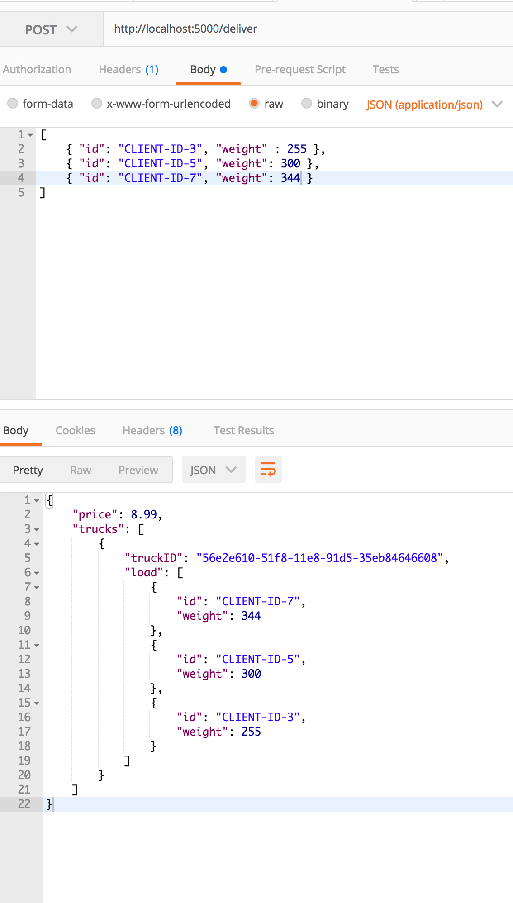

# logistics-api (recruitment assignment)

This project is pure API. No front-end created. 

1) `git clone git@github.com:sweettirexkiller/hands-on-express-api.git`
2) `logistics-api`
3) `npm install`
4) `nano index.js`

        ...
        const MONGODB_URI = 'mongodb://localhost/YOUR_DB_HERE';
        ...
        
    `ctrl+O ctrl+X`
 
5) `npm run dev` -> [localhost:5000](http://localhost:5000)
6) use postman for these routes: 

        / (GET)
        /delivery (GET, POST)
        /public/prices.pdf (GET)
        
 > None of the routes require authentication
        
        
        